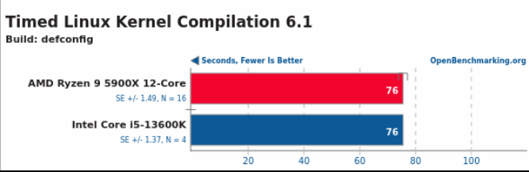

# BENCHMARKS

- **Integrantes:** {cristian.pereyra,francisco.coschica,nicolas.lopez.casanegra}@mi.unc.edu.ar 
- **Profesor:** Javier Jorge

- [X] Benchmark
- [X] Rendimiento

## Objetivos

El objetivo de esta tarea es poner en práctica los conocimientos sobre performance y rendimiento de los computadores. 

El trabajo consta de dos partes 

1. Utilizar benchmarks de terceros para tomar decisiones de hardware. 

2. Consiste en utilizar herramientas para medir la performance de nuestro código.

En un informe deberán responder a las siguientes preguntas y mostrar con capturas de pantalla la realización del tutorial descrito en time profiling adjuntando las conclusiones sobre el uso del tiempo de las funciones.

I. Armar una lista de benchmarks, ¿cuales les serían más útiles a cada uno ? ¿Cuáles podrían llegar a medir mejor las tareas que ustedes realizan a diario ? ensar en las tareas que cada uno realiza a diario y escribir en una tabla de dos entradas las tareas y que benchmark la representa mejor.

II- ¿Cuál es el rendimiento de estos procesadores para compilar el kernel de linux ?

Intel Core i5-13600K
AMD Ryzen 9 5900X 12-Core

https://openbenchmarking.org/test/pts/build-linux-kernel-1.15.0

III- ¿Cual es la aceleración cuando usamos un AMD Ryzen 9 7950X 16-Core ?

### Benchmark

Un benchmark se lo puede definir como “Un estándar de calidad que puede ser utilizado como nivel de referencia al comparar otras cosas”. Estos son una herramienta útil para evaluar y comparar el rendimiento de diferentes dispositivos, componentes, sistemas y así también como para la vida diaria.

Dependiendo del objetivo específico que se quiere conseguir y del punto concreto que estamos comparando, podemos identificar diferentes tipos de benchmarking.

- **Funcional:** Nos fijamos en lideres del mercado para buscar puntos en comun.
- **interno:** Se busca puntos de mejoras, aumento de la eficiencia y efectividad sin mirar a otros
- **Competitivo:** Una vez identificado los puntos debiles revisamos la informaciós de nuestros competidores.
- **Procesos:** Centrarse en un punto especifico mirando a nuestros competidores
- **Productos:** Encontrar lo que no está siendo satisfecho o que pueden cubrirse de manera diferente a como se estaba haciendo ahora.
- **Servicios:** Apoyados en encuestas de satifcación servirá para averiguar cómo ofrecer un servicio mas compelto o servicios alternativos.
- **Costos:** Buscamos reducir costos y mejorar la rentabilidad.

Dentro del contexto de los programas informaticos tenemos

- **Sinteticos**
- **Reducidos**
- **Kernel**
- **Reales**

Para hacer un benchmarking efectivo, estos son los pasos que debes seguir:

1. Define el objetivo
2. Selecciona el area de benchmarking
3. Identifica competidores
4. Recopila información
5. Analiza la información
6. Implementa cambios
7. Evalua y Repite

**¿cuales les serían más útiles a cada uno? ¿Cuáles podrían llegar a medir mejor las tareas que ustedes realizan a diario ? Pensar en las tareas que cada uno realiza a diario y escribir en una tabla de dos entradas las tareas y que benchmark la representa mejor.**

| Tarea | Benchmark |
|-|-|
| Contratar un proveedor de internet | Servicos, costos, Productos |
| Cambiar el proveedor de internet | Competitivo, Servicos, costos, Productos |
| Preparar un final | Interno | 
| Performance de un API | Reducido. kernel |

### Rendimiento

- **¿Cuál es el rendimiento de estos procesadores para compilar el kernel de linux ?**

Para realizar la comparación entre los microprocesadores AMD Ryzen 9 5900X 12-Cor y Intel Core i5-13600K utilizaremos Open Benchmarking.

Open Benchmarking es una página open-source que permite a los usuarios comparar el rendimiento de microprocesadores. Esta página posee un test que mide el rendimiento que tienen los procesadores en compilar el kernel de linux ya sea una configuración del kernel (defconfig) o con la configuración que incluye todos los drivers y módulos (allmodconfig). Nosotros usaremos los dos ya que no existen benchmarks para una versión pero si para otra.
¿Cuál es el rendimiento de estos procesadores para compilar el kernel de linux ?
Para calcular el rendimiento utilizamos la fórmula  

$$
n = \frac{1}{\text{tiempo}}\ [s^{-1}]
$$

Donde el tiempo en nuestro caso sería representado por el tiempo de compilación. Por lo que obtuvimos los siguientes resultados:

| Componente | v1.14x [mHz] | v1.15x [mHz] |
|:-|:-:|:-:|
| AMD Ryzen 9 5900X 12-Core | 1.29 | 13.2 |
| Intel Core i5-13600K | 1.42 | 13.2 |

La versión 1.14x usa allmodconfig y la 1.15x defconfig.

Para la versión 1.14x el micro de AMD obtuvo una clara ventaja sobre Intel pero a partir de la versión 1.15x ambos obtuvieron el mismo rendimiento, este cambio se pudo porque se agregaron nuevas características, se realizaron nuevas optimizaciones, configuración del kernel, etc.. Lo curioso es que el número de muestras de Intel tiene solo 4 benchmarks es pequeño comparado que el de AMD por lo cual es cuestionable decir que ambos tienen el mismo rendimiento. Si planteamos intervalos de confianza para ambos procesadores podremos tener otra perspectiva del rendimiento de estos. Solo se usaron los valores de la versión 1.15x.

| Componente|Rank|Resultados públicos|Segundos (Media)|IC 95% (Normal)|IC 95% (t-student)|
|:-|:-:|:-:|:-:|:-:|:-:|
| AMD Ryzen 9 5900X 12-Core    | 55th | 16                  | 76 +/- 6         | 12.63 , 13.73    | 12.69, 13.66       |
| Intel Core i5-13600K         | 55th | 4                   | 76 +/- 3         | 12.38, 14.04     | 13.02, 13.30       |

A partir de los intervalos de confianza podemos decir que el procesador de AMD tiene un mejor y peor rendimiento en el mejor y peor de los casos respectivamente si utilizamos t-student. En cambio usando la distribución normal el rendimiento de micro de Intel es mucho peor que el de AMD.

- **¿Cual es la aceleración cuando usamos un AMD Ryzen 9 7950X 16-Core ?**

Según las ley de Amdahl  podemos decir que la aceleración es igual a:

$$
\text{aceleración} = \frac{R_{\text{sist.nuevo}}}{R_{\text{sist.antiguo}}}
$$

$R: Rendimiento$

por lo cual para el procesador AMD Ryzen 9 7950X 16-Core según el tiempo de compilación de kernel de linux en la versión 1.14x y 1.15x es de 

$$
\text{aceleración} = \frac{513\ [s^{-1}]}{1457\ [s^{-1}]} = 0.89
$$