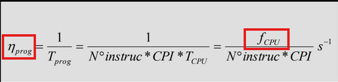
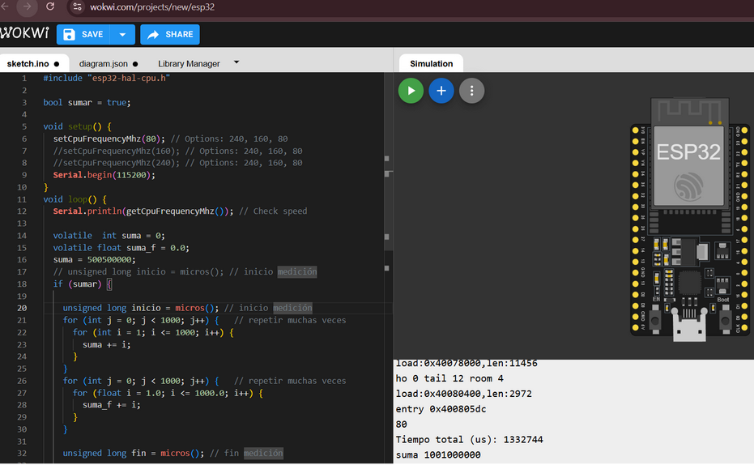

# ESP32

- **Integrantes:** {cristian.pereyra,francisco.coschica,nicolas.lopez.casanegra}@mi.unc.edu.ar 
- **Profesor:** Javier Jorge


# Objetivos

Conseguir un esp32 o cualquier procesador al que se le pueda cambiar la frecuencia. 
Ejecutar un código que demore alrededor de 10 segundos. Puede ser un bucle for con sumas de enteros por un lado y otro con suma de floats por otro lado. 

### Qué sucede con el tiempo del programa al duplicar (variar) la frecuencia ?

Se reduce cumpliendose la ecuación de Rendimiento donde al no modificar las instrucciones pero si se varía la frecuencia, varía el rendimiento



### Tabla resumen


| Frequency | Tprog [us]  | | Result |
|-|-|-|-|
| 240 | 1316508 | 1316508 | 1001000000 |
| 160 | 1320544 | 1320484 | 1001000000 |
| 80  | 1332744 | 1332809 | 1001000000 |

### simulador

- https://wokwi.com/projects/new/esp32 



### Código

```C
#include "esp32-hal-cpu.h"
bool sumar = true;

void setup() {
  // Options: 240, 160, 80
  setCpuFrequencyMhz(80); 
  //setCpuFrequencyMhz(160);
  //setCpuFrequencyMhz(240);
  Serial.begin(115200);
}

void loop() {
  Serial.println(getCpuFrequencyMhz()); // Check speed

  volatile  int suma = 0;
  volatile float suma_f = 0.0;
 
  if (sumar) {
    unsigned long inicio = micros(); // inicio medición
    for (int j = 0; j < 1000; j++) {   
      for (int i = 1; i <= 1000; i++) { suma += i;  }
    }
    for (int j = 0; j < 1000; j++) { 
      for (float i = 1.0; i <= 1000.0; i++) { suma_f += i;  }
    }

    unsigned long fin = micros(); // fin medición

    Serial.print("Tiempo total (us): ");
    Serial.println(fin - inicio);
  }
  
  Serial.print("suma ");
  Serial.println(suma);
  sumar = false;
}
```