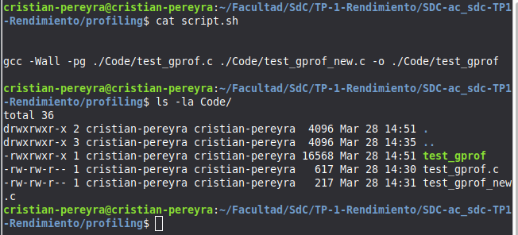
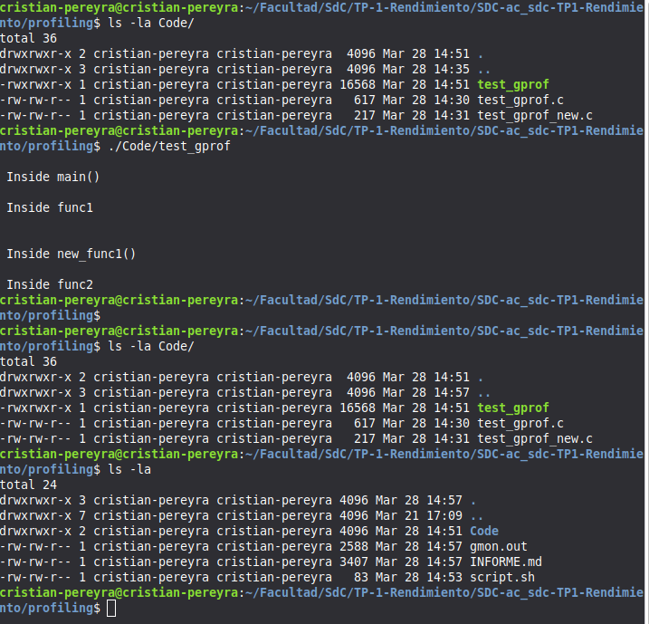
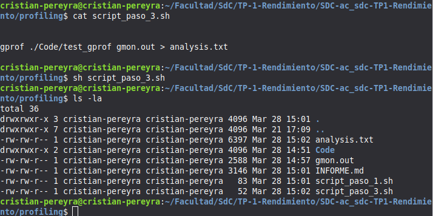
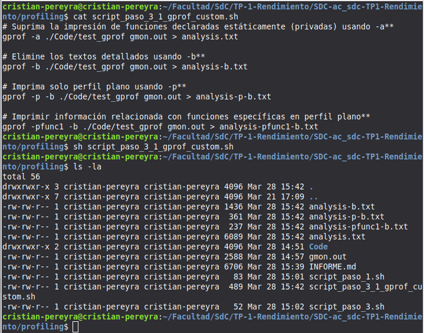
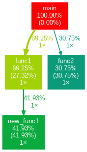

# PROFILING

- **Integrantes:** {cristian.pereyra,francisco.coschica,nicolas.lopez.casanegra}@mi.unc.edu.ar 
- **Profesor:** Javier Jorge

## Objetivo

Utilizar herramientas para medir la performance de nuestro código.

- ¿Cómo funcionan los perfiladores de código (tiempo)?

Los generadores de perfiles de código a menudo se usan para analizar no solo cuánto tiempo tarda en ejecutarse un programa (podemos obtenerlo de herramientas a nivel de shell como /usr/bin/time), sino también cuánto tiempo tarda en ejecutarse cada función o método (tiempo de CPU). Dos técnicas principales utilizadas por los perfiladores: *inyección de código, muestreo.*

- Memoria

Además del tiempo de ejecución, a menudo queremos analizar cuánta memoria utiliza un programa. Ideas de implementación similares, pero implica la inserción de código para verificar cuánta memoria está en uso por el programa en los puntos de control. También podría incluir código para rastrear dinámicamente cada elemento de memoria asignado, para monitorear su tamaño, ver si está liberado o no, verificar si hay fugas de memoria, etc.

### Paso 1: creación de perfiles habilitada durante la compilación

En este primer paso, debemos asegurarnos de que la generación de perfiles esté habilitada cuando se complete la compilación del código. Esto es posible al agregar la opción '-pg' en el paso de compilación. 

```
Del man de gcc: 
-pg : Generate extra code to write profile information suitable for the analysis 
program gprof. You must use this option when compiling the source files you want 
data about, and you must also use it when linking. 
```

Entonces, compilemos nuestro código con la opción '-pg': 

```bash
$ gcc -Wall -pg test_gprof.c test_gprof_new.c -o test_gprof 
```



### Paso 2: Ejecutar el código

En el segundo paso, se ejecuta el archivo binario producido como resultado del paso 1 (arriba) para que se pueda generar la información de perfiles. 

```bash
$ ls 
test_gprof  test_gprof.c  test_gprof_new.c 

$ ./test_gprof  
Inside main() 
Inside func1  
Inside new_func1() 
Inside func2  

$ ls 
gmon.out  test_gprof  test_gprof.c  test_gprof_new.c 
```

Entonces vemos que cuando se ejecuta el binario, se genera un nuevo archivo 'gmon.out' en el directorio de trabajo actual. 
Tenga en cuenta que durante la ejecución, si el programa cambia el directorio de trabajo actual (usando chdir), se generará gmon.out en el nuevo directorio de trabajo actual. Además, su programa debe tener permisos suficientes para que gmon.out se cree en el directorio de trabajo actual.



### Paso 3: Ejecute la herramienta gprof

En este paso, la herramienta gprof se ejecuta con el nombre del ejecutable y el 'gmon.out' generado anteriormente como argumento. Esto produce un archivo de análisis que contiene toda la información de perfil deseada. 

```bash
$  gprof test_gprof gmon.out > analysis.txt 

$ ls 
analysis.txt  gmon.out  test_gprof  test_gprof.c  test_gprof_new.c 
```

Entonces vemos que se generó un archivo llamado 'analysis.txt'. 



#### **Comprensión de la información de perfil**

- **tiempo total** de ejecución registrado fue de 12.52 segundos.
- **new_func1** es la función donde mayor tiempo se estuvo ejecutando el programa conun tiempo de 5.25 segundos
- **func1** tiene un total de 8.67 segundos de ejecución en total debid aque esta llamos a new_func1. El tiempo que le llevó a new_func1 se suma al tiempo de func1


```
Flat profile:

Each sample counts as 0.01 seconds.
  %   cumulative   self              self     total           
 time   seconds   seconds    calls   s/call   s/call  name    
 41.93      5.25     5.25        1     5.25     5.25  new_func1
 30.75      9.10     3.85        1     3.85     3.85  func2
 27.32     12.52     3.42        1     3.42     8.67  func1
```


```
Call graph (explanation follows)


granularity: each sample hit covers 4 byte(s) for 0.08% of 12.52 seconds

index % time    self  children    called     name
                                                 <spontaneous>
[1]    100.0    0.00   12.52                 main [1]
                3.42    5.25       1/1           func1 [2]
                3.85    0.00       1/1           func2 [4]
-----------------------------------------------
                3.42    5.25       1/1           main [1]
[2]     69.2    3.42    5.25       1         func1 [2]
                5.25    0.00       1/1           new_func1 [3]
-----------------------------------------------
                5.25    0.00       1/1           func1 [2]
[3]     41.9    5.25    0.00       1         new_func1 [3]
-----------------------------------------------
                3.85    0.00       1/1           main [1]
[4]     30.8    3.85    0.00       1         func2 [4]
-----------------------------------------------

```

#### Customize gprof output using flags

1. **Suprima la impresión de funciones declaradas estáticamente 
(privadas) usando -a**

```bash
$ gprof -a test_gprof gmon.out > analysis.txt 
```

2. **Elimine los textos detallados usando -b**

```bash
$ gprof -b test_gprof gmon.out > analysis.txt 
```

3. **Imprima solo perfil plano usando -p** 

```bash
$ gprof -p -b test_gprof gmon.out > analysis.txt 
```

4. **Imprimir información relacionada con funciones específicas en perfil 
plano**

```bash
$ gprof -pfunc1 -b test_gprof gmon.out > analysis.txt 
```



### Genere un gráfico

gprof2dot es una herramienta que puede crear una visualización de la salida de gprof.  

```bash
#instalar gprof2dot:  
sudo apt update
sudo apt install pipx
pipx ensurepath // Actualiza el PATH automáticamente
source ~/.bashrc // Para que tu terminal actual "se entere" del cambio, 
pipx install gprof2dot --force
#$ pip instalar gprof2dot  

#instalar graphviz (que es necesario si va a hacer gráficos de "puntos" como el siguiente):  
$ sudo apt install graphviz  
```

```bash
gprof ./Code/test_gprof gmon.out | gprof2dot | dot -Tpng -o ../../images/profiling/graph.png
```





## Profiling con linux perf

Perf es una pequeña herramienta que acabo de encontrar para crear perfiles de programas. 
Perf utiliza perfiles estadísticos, donde sondea el programa y ve qué función está funcionando. 
Esto es menos preciso, pero tiene menos impacto en el rendimiento que algo como Callgrind, que rastrea cada llamada. Los resultados siguen siendo razonablemente precisos, e incluso con menos muestras, mostrará qué funciones están tomando mucho tiempo, incluso si pierde funciones que son muy rápidas (que probablemente no sean las que está buscando al perfilar 
de todos modos). 

- https://dev.to/etcwilde/perf---perfect-profiling-of-cc-on-linux-of  


```bash
# instalación 
$ sudo apt install -y linux-tools-common 
$ sudo apt install -y linux-tools-common linux-tools-$(uname -r)

# Ejecución 
$ sudo perf record -o ./perf/perf.data ./Code/test_gprof
$ sudo perf report -i ./perf/perf.data --stdio > ./perf/reporte_perf.txt
```

- func1 (39.55%): Es la función que más estresa al CPU.
- func2 (28.11%): La segunda en importancia.
- new_func1 (23.98%): La tercera.


```
# Overhead  Command     Shared Object         Symbol                                          
# ........  ..........  ....................  ................................................
#
    39.55%  test_gprof  test_gprof            [.] func1
    28.11%  test_gprof  test_gprof            [.] func2
    23.98%  test_gprof  test_gprof            [.] new_func1
     2.78%  test_gprof  test_gprof            [.] main
```

Comparando con gprof:

```
    new_func1 parecía ser la más pesada (41%).
    Aquí en perf, func1 es la más pesada (39.55%).
```

¿Por qué pasa esto?

gprof usa instrumentación (modifica el código) y a veces eso altera las mediciones (overhead). perf usa muestreo por hardware, lo que suele ser más preciso para saber qué está haciendo realmente el silicio del procesador en cada instante.