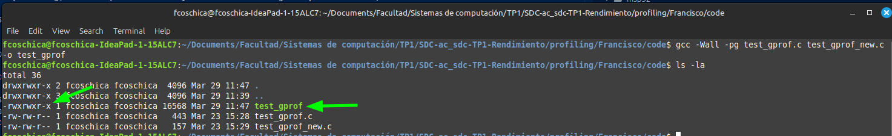
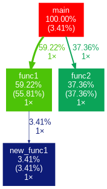

# PROFILING

## Objetivo

Utilizar herramientas para medir la performance de nuestro código.

---

## Informe

Se realizó la práctica de profiling, en esta práctica trabajamos sobre un código de prueba en `c`, el cual consta de 4 funciones incluyendo al `main`, `func1`, `func2` y `new_func1`. Utilizamos la herramienta de profiling de GNU `gprof`, mediante la cual podemos darnos una idea de la ejecución del código, los tiempos de ejecución de cada función y una idea de los bucles y cadenas de llamados entre funciones.

Para poder realizar el profiling compilamos el código con el compilador de GNU `gcc` de la siguiente manera:

`gcc -Wall -pg test_gprof.c test_gprof_new.c -o test_gprof`

Donde la opción `-pg` es la que se encarga de insertar en el código durante la compilación pequeños fragmentos de código que registran la información necesaria para las herramientas de profiling como `gprof`. El resultado de este comando es un nuevo archivo `test_gprof` que es un binario ejecutable.



De por sí con lo generado hasta ahora no podemos realizar el profiling, ya que para generar la información necesaria para el profiling el código debe ser ejecutado. Ejecutamos el código:

`./test_gprof`

En consola vemos la ejecución (que solo son unos logs), al finalizar vemos que tenemos un nuevo archivo `gmon.out` que contiene la información requerida para el profiling.

Generamos ahora el análisis de profiling con la herramienta `gprof` haciendo:

`gprof test_gprof gmon.out > analysis.txt`

Donde `analysis.txt` es donde queremos volcar la información/salida de este comando. El análisis generado consta de:

- Una tabla llamada `Flat profile` la cual nos permite ver rápidamente los tiempos insumidos por cada función ordenado desde la función que más tiempo insume hasta la que menos tiempo insume. Permitiéndonos ver el tiempo insumido por función de varios ángulos, por función, acumulado, solo el trabajo realizado por esa función sin contar el tiempo insumido por otras funciones (`self s/call`) y por último contando el tiempo insumido por otras funciones (`total s/call`).
- La explicación de qué representa cada columna de la tabla `Flat profile`.
- Una tabla llamada `Call graph` que describe la ejecución del programa. Tiene tantas entradas como funciones y se centra en el análisis de la secuencia de llamadas asociadas a cada función. Asigna a cada función un número entre corchetes ej: [1]. La primer columna, `index`, nos indica qué función se analiza, la última columna `name` que nos muestra la secuencia de llamadas que se desprenden de la función bajo análisis. Entre medio tenemos:
  - `self`: nos indica cuánto tiempo insumió cada función sin contar el tiempo insumido por las funciones hijas.
  - `children`: Muestra cuánto tiempo insumieron las funciones hijas de cada función, 0 si una función no llama a ninguna otra.
  - `called`: Indica cuántas veces se ejecutó una función, su interpretación cambia dependiendo de si es una función padre o hija:
    - Función padre: Indica cuántas veces se llamó la función, y si hubo llamadas recursivas se marcan con `+[cantidad_de_llamadas_recursivas]`.
    - Función hija: Muestra dos números en este formato `[x]/[y]` donde `x` es la cantidad de veces que la función padre llamó a la función hija e `y` el número total de llamados que recibió esta función en el programa.
- Además de estas dos tablas debajo de cada una se encuentra texto informativo sobre el significado de cada columna.

La herramienta `gprof` proporciona algunas opciones a la hora de generar el análisis permitiéndonos mostrar u ocultar ciertas partes de la salida convencional. Las opciones son las siguientes:

- `-a`: Filtra del análisis las funciones privadas/estáticas.
- `-b`: Elimina los textos detallados debajo de cada tabla.
- `-p`: Imprime solo la primer tabla `Flat profile`.
- `-p[nombre_de_funcion]`: Imprime solo del `Flat profile` la entrada relacionada a la función especificada.

Podemos usar un gráfico para visualizar la salida de gprof con `gprof2dot`, que genera una representación visual como esta:



### Profiling con linux perf

Se realiza el análisis con la herramienta linux perf. Primero generamos la información necesaria para el profiling ejecutando el código con la herramienta:

`sudo perf record ./test_gprof`

Y luego podemos visualizar los resultados con:

`sudo perf report`

Salida:

```text
Samples: 52K of event 'cycles:P', Event count (approx.): 55731477189
Overhead Command Shared Object Symbol
55.40% test_gprof test_gprof [.] func1
37.47% test_gprof test_gprof [.] func2
3.47% test_gprof test_gprof [.] main
3.40% test_gprof test_gprof [.] new_func1
0.09% test_gprof [kernel.kallsyms] [k] srso_safe_ret
0.02% test_gprof [kernel.kallsyms] [k] native_sched_clock
0.01% test_gprof [kernel.kallsyms] [k] hrtimer_interrupt
0.01% test_gprof [kernel.kallsyms] [k] read_hpet
0.01% test_gprof [kernel.kallsyms] [k] task_tick_fair
0.01% test_gprof [kernel.kallsyms] [k] fpu**clear_user_states
0.00% test_gprof [kernel.kallsyms] [k] **irq_exit_rcu
0.00% test_gprof [kernel.kallsyms] [k] lapic_next_event
0.00% test_gprof [kernel.kallsyms] [k] srso_return_thunk

```

Que muestra ordenado de mayor a menor tiempo insumido todas las funciones involucradas en la ejecución del programa. Permitiéndonos observar a su vez la incidencia del entorno de ejecución sobre el programa. En el gráfico podemos observar y medir el impacto en tiempo de las operaciones que realiza el kernel cuando se ejecuta el programa.
